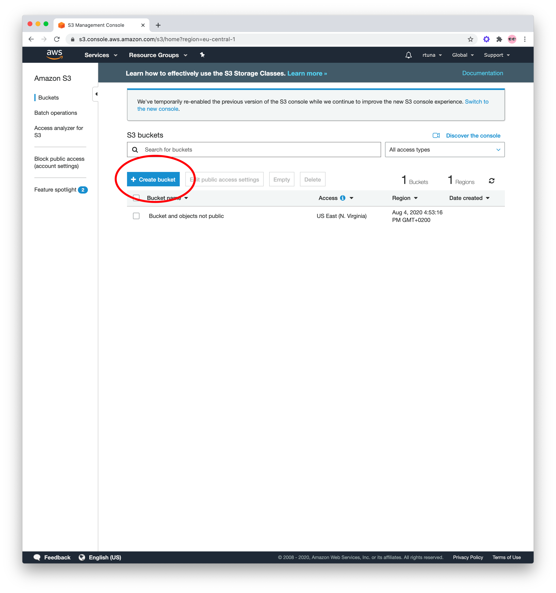
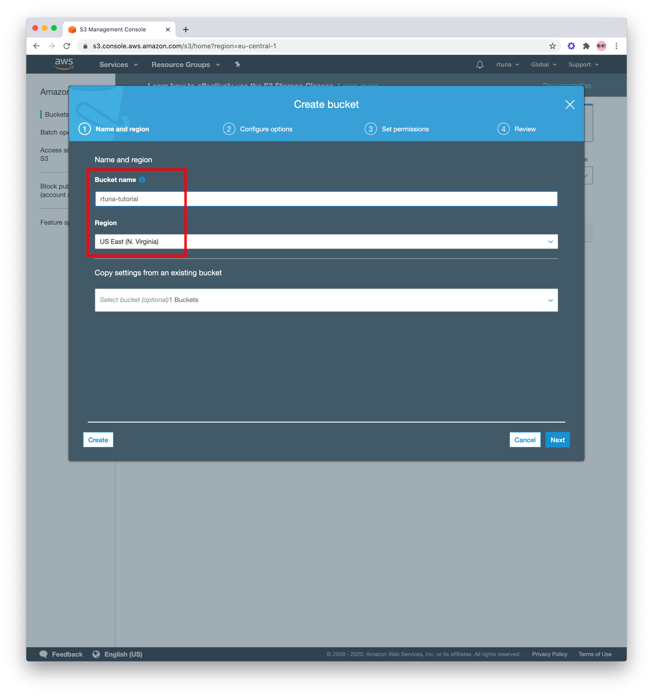
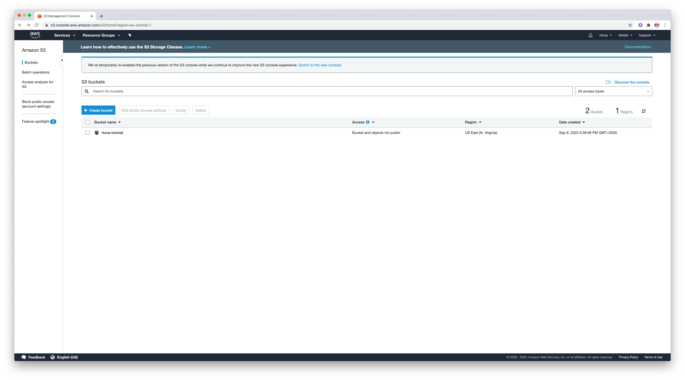

<h1>Table of contents</h1>

<li>
  <a href="https://github.com/bonzayio/discord-coins/tree/master/configuration#creating-an-aws-s3-bucket">
    Creating an S3 Bucket
  </a>
</li>
<li>
  <a href="https://github.com/bonzayio/discord-coins/tree/master/configuration#obtaining-api-keys-for-twitter--aws">
    Getting API keys
  </a>
</li>
<li>
  <a href="">
    Configuring the bot
  </a>
</li>
 
 
 
 
 
 
<h1>Creting an AWS S3 Bucket</h1>

First of all, make sure you have an [AWS](https://aws.amazon.com/) account. It's fairly simple to register for AWS, just google around if you get stuck!

Next up, navigate to the [S3 console](https://s3.console.aws.amazon.com/s3/home). You will need to create a bucket.

  

Fill out the <b>Bucket name</b> and select <i>US East (N. Virginia)</i> as the region. 

  

Leave everything as default and keep clicking next until you get to the review screen. Then, press <b>Create Bucket</b>.

 

If you did everything correctly, your screen should look something like this:

  

<h1>Obtaining API keys for Twitter & AWS</h1>
Now you will need to get API credentials that you will put into the configuration files.

<h2> Getting AWS API credentials</h1>
What you need to do, is create an IAM user, which access keys we will use. Follow
<a href="https://docs.aws.amazon.com/IAM/latest/UserGuide/id_users_create.html"> this guide</a>, if you don't know how to go about that!

 
 
You will need an access key ID and secret access key. Once you get those two keys, fill them out into 'aws.json' file.
 
 

<h2> Getting Twitter API credentials</h1>
You will need a
<a href="https://developer.twitter.com/">
Twitter Developer</a> account for this one. If you don't know how to obtain the 4 keys needed, follow
<a href="https://themepacific.com/how-to-generate-api-key-consumer-token-access-key-for-twitter-oauth/994/">
This guide</a>!
 
You will then be putting these 4 keys into the 'twitter.json' file.
 

 
 

<h1>Configuring the bot</h1> 
<h3>'aws.json'</h3>
<h3>'twitter.json'</h3>
<h3>'discord-token.txt'</h3>
This is where your Discord Bot token goes. If you don't have a Discord bot yet or don't know how to get the token, follow <a href="https://discordjs.guide/preparations/setting-up-a-bot-application.html#creating-your-bot">this guide</a>!
<h3>'config.json'</h3>